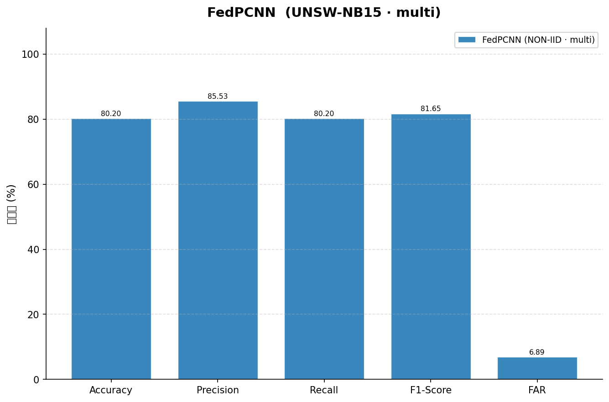
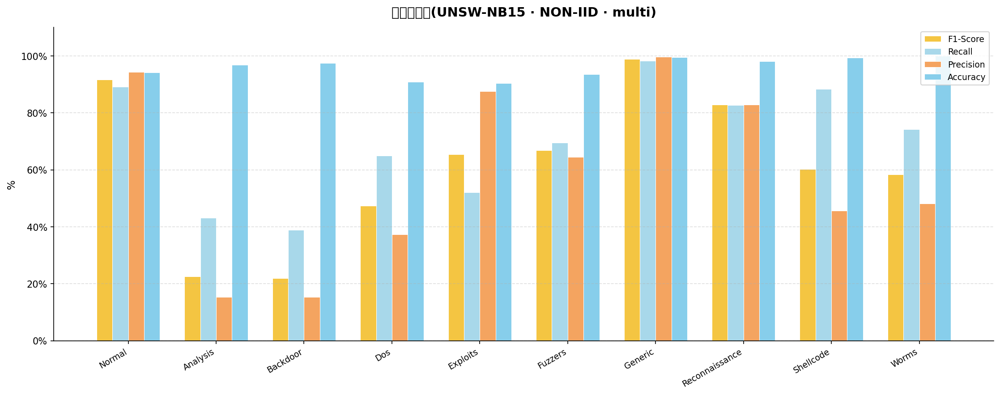
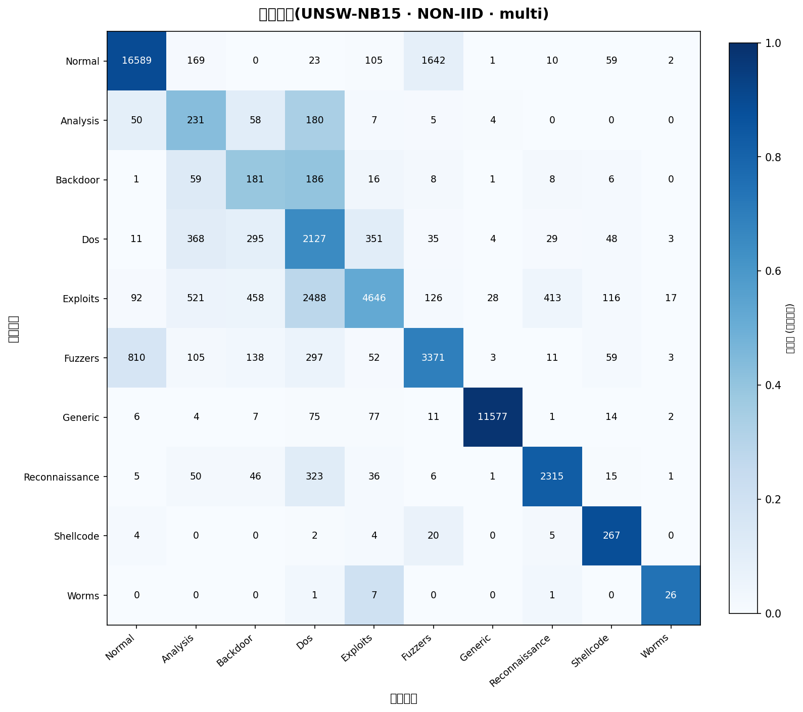
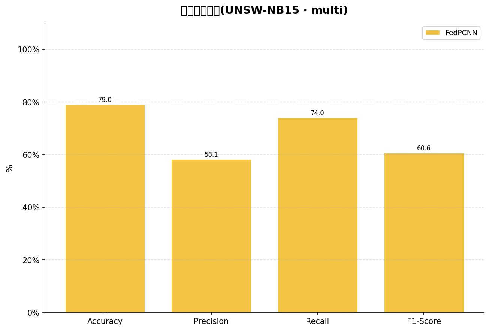
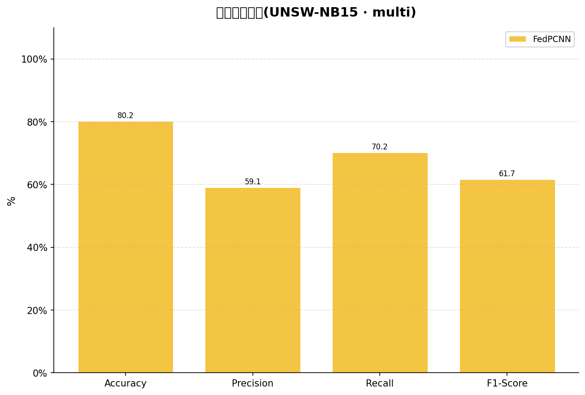

# 客户汇报版实验结果

日期：2026-03-22

## 一、结论摘要

当前最佳结果来自 `cloud-bohb50`：

- Accuracy：`80.20%`
- Macro-F1：`61.65%`
- FAR：`6.89%`

相较上一轮云端正式基线 `cloud-base60`（`79.01 / 60.64 / 7.41`），本轮在三项关键指标上都实现了同步改善：

- Accuracy：`+1.19`
- Macro-F1：`+1.01`
- FAR：`-0.52`

相较仓库记录中的历史最佳 `80.68 / 62.63 / 6.41`，当前结果已经明显逼近，剩余差距约为：

- Accuracy：`-0.48`
- Macro-F1：`-0.98`
- FAR：`+0.48`

## 二、实验对比

| 实验 | Accuracy | Macro-F1 | FAR | 说明 |
|------|----------|----------|-----|------|
| 历史最佳 | 80.68% | 62.63% | 6.41% | 仓库3/14记录 |
| cloud-base60 | 79.01% | 60.64% | 7.41% | RTX4090, 60轮 |
| cloud-bohb50 | 80.20% | 61.65% | 6.89% | RTX4090, 50轮 + BOHB |

## 三、图表展示

### 1. `cloud-bohb50` 总体指标图

### 2. `cloud-bohb50` 逐类别指标图

### 3. `cloud-bohb50` 混淆矩阵

### 4. `cloud-base60` 与 `cloud-bohb50` 对比参考

`cloud-base60`

`cloud-bohb50`

## 四、交付物位置

完整图表、结果文件、模型文件均已归档：

- [results/archive/2026-03-21_235621_base60_2026-03-21_235639](/Users/zhuguowei/Downloads/FL/results/archive/2026-03-21_235621_base60_2026-03-21_235639)
- [results/archive/2026-03-22_092211_bohb50_2026-03-22_092745](/Users/zhuguowei/Downloads/FL/results/archive/2026-03-22_092211_bohb50_2026-03-22_092745)

实验日志总表：

- [EXPERIMENT_LOG.md](/Users/zhuguowei/Downloads/FL/EXPERIMENT_LOG.md)
